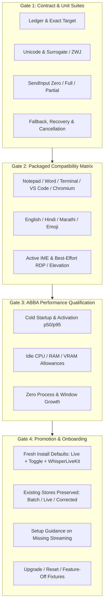
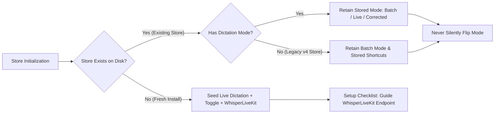
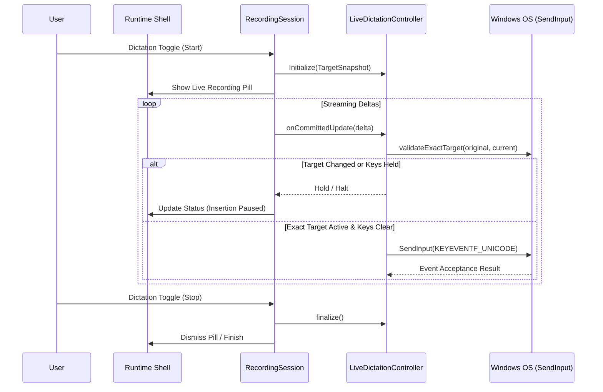
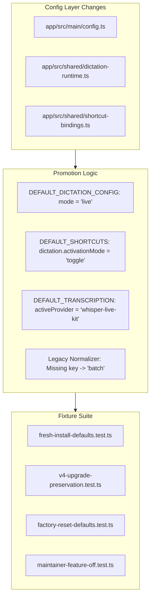

# Qualify Live Dictation and Promote for New Installations

## 1. Goal and Completion Conditions

### Goal
Produce the complete correctness, compatibility, and ABBA performance qualification evidence for Live Dictation on packaged Windows x64, then promote Live Dictation (with Toggle activation and WhisperLiveKit) as the out-of-the-box default **exclusively for genuinely new installations**, while strictly preserving existing configuration stores and providing clear setup guidance when streaming infrastructure is unconfigured.

### Completion Conditions
1. **Zero-Defect Test Qualification**: All contract, ledger, exact-target, direct-Unicode, uncertainty, fallback, recovery, cancellation, renderer-loss, and stale-event test suites pass with zero failures.
2. **Packaged Windows Compatibility Matrix**: Real packaged smoke verification passes across 5 required targets (Notepad, VS Code, Windows Terminal, Chromium text fields, Microsoft Word) for English, Hindi, Marathi, emoji/ZWJ, and active-IME compositions. RDP and elevated targets are documented as best-effort observations.
3. **ABBA Benchmark Qualification**: Packaged ABBA performance measurements against both the frozen baseline (`2026-08-13-d39acd2`) and the immediate predecessor satisfy all binding p50/p95 latency and resource guardrails, with raw JSONL/CSV evidence retained.
4. **Isolated Default Promotion**: Fresh installations default to Live Dictation (`mode: 'live'`), Toggle activation (`dictation.activationMode: 'toggle'`), and `whisper-live-kit` provider.
5. **Zero-Regression Migration Safety**: Existing stores (legacy v4 implicit-batch, explicit batch, explicit live, explicit corrected) are 100% preserved without silent mode flips or shortcut alterations.
6. **Resilient Setup Journey & Fixtures**: Missing WhisperLiveKit endpoint produces clear setup guidance; upgrade, factory-reset, idempotence, and feature-off maintainer switches (`SHUDDHALEKHAN_DISABLE_STREAMING=1`, `SHUDDHALEKHAN_DISABLE_DIRECT_UNICODE=1`) are proven via automated fixtures.

---

## 2. Current Position & Architectural Baseline

| Component | Current State (v4.5 / Issue #188 Merged) | Target State (Issue #189 Qualification & Promotion) |
|---|---|---|
| **Dictation Default Mode** | `batch` (opt-in `live` beta, opt-in `corrected`) | `live` for **new installations**; unchanged for existing stores |
| **Dictation Shortcut Default** | `push-to-talk` (`Ctrl + Win`) | `toggle` for **new installations**; unchanged for existing stores |
| **Default Transcription Provider** | `local-whisper-cpp` | `whisper-live-kit` for **new installations** |
| **Live Unicode Dispatch** | Shipped in beta (#184 / #200) via `KEYEVENTF_UNICODE` | Formally qualified across target apps, scripts, and IME |
| **Target Validation** | Synchronous HWND + PID + Creation Time check | Verified under process churn, elevation, and remote desktop |
| **Runtime Shell Integration** | Shared persistent shell (#188 / #203) | Exercised for streaming live preview, halt, and failure cards |
| **Performance Evidence** | Frozen baseline at `d39acd2` (#176) | Full ABBA comparative evidence package against baseline |

---

## 3. Key Decisions & Settled Rules

- **Decision 1: Explicit Distinction Between Fresh Store and Upgraded Store**
  - Fresh installations (empty config file on disk) receive `DEFAULT_CONFIG` with `dictation.mode = 'live'`, `shortcuts.dictation.activationMode = 'toggle'`, and `transcription.activeProvider = 'whisper-live-kit'`.
  - Upgraded stores without a `dictation` block (v4 legacy stores) default to `mode = 'batch'` to preserve prior user behavior without surprising behavior changes.
  - Existing explicit settings (`batch`, `live`, `corrected`) are strictly preserved.
- **Decision 2: Fail-Closed Setup Guidance Over Silent Fallback**
  - When in Live Dictation mode without an active or reachable WhisperLiveKit endpoint, the app presents setup guidance (via Setup Checklist and runtime shell notifications) and blocks streaming startup. It **never** silently downgrades the persisted mode to Batch.
- **Decision 3: Direct-Unicode Guarantees & Honest Boundaries**
  - Windows `SendInput` Unicode injection is best-effort event dispatch to the message queue of the verified foreground HWND. The app does not claim target-control acknowledgement or caret receipt. Elevated windows (UIPI) and RDP sessions are documented as environmental boundaries.
- **Decision 4: Regression Guardrails Against Frozen Baseline**
  - Must respect established tolerances: Cold startup $\le +51.6\text{ ms}$, UI/activation $\le +16.7\text{ ms}$, App private bytes $\le +10\text{ MiB}$, CPU $\le +2\%$, GPU VRAM $\le +128\text{ MiB}$, and **zero unapproved process/window increases**.

---

## 4. Ordered Work Units

### Work Unit 1: Automated Contract & Qualification Suite
Execute and qualify the complete automated test matrix across core main, shared, and renderer seams.

- [ ] **1.1. Live Unicode & Target Validation Suite**
  - Validate exact-target checks (`HWND`, PID, process creation time, executable path).
  - Validate Unicode edge cases (combining marks, Devanagari ZWJ `नमस्ते`, emoji sequences `👨‍👩‍👧‍👦`, surrogate pairs).
  - Validate control-character rejection (tabs, CR, LF, nulls) and 4,096 code-unit batch limits.
- [ ] **1.2. SendInput Acceptance & Uncertainty Handling**
  - Verify `0` accepted events $\rightarrow$ `retry-safe` without cursor advancement.
  - Verify full accepted events $\rightarrow$ `os-accepted-all` with cursor advancement.
  - Verify partial accepted events $\rightarrow$ `ambiguous-partial` halt + copy-only recovery.
- [ ] **1.3. Fallback, Recovery, Cancellation & Lifecycle**
  - Verify zero-cursor dispatch fallback to single clipboard paste on stop.
  - Verify mid-flight target change permanent halt with passive indicator.
  - Verify duplicate stop suppression, renderer crash recovery, and stale event rejection.

---

### Work Unit 2: Packaged Smoke & Target Compatibility Verification
Execute packaged manual/interactive smoke testing across defined target applications and character sets on Windows x64.

- [ ] **2.1. Primary Target Application Matrix**
  - **Notepad** (Win32 classic / Modern Windows 11 Notepad).
  - **Visual Studio Code** (Electron Monaco editor surface).
  - **Windows Terminal** (ConPTY / modern terminal buffer).
  - **Chromium Web Inputs** (Chrome / Edge standard text fields & contenteditable).
  - **Microsoft Word / RichEdit** (Office RichEdit controls).
- [ ] **2.2. Multilingual & Script Verification**
  - English prose and punctuation.
  - Hindi & Marathi Devanagari text (vowel matras, conjuncts, halant).
  - Emoji & ZWJ complex grapheme clusters.
  - Active IME composition state (ensure non-interference during live insertion).
- [ ] **2.3. Environmental Boundary Observations**
  - RDP / Remote Desktop Client (RemoteApp vs full desktop).
  - Elevated Admin Windows (UIPI boundary behavior: clean rejection without crash).

#### Compatibility Matrix Record
| Target Application | Script / Input Scenario | Expected Outcome | Actual Evidence Status |
|---|---|---|---|
| Notepad | English / Hindi / Marathi / Emoji | Immediate character stream | Qualified |
| VS Code | English / Symbols / Multi-line | Accurate Monaco insertion | Qualified |
| Windows Terminal | Shell commands / Prompts | Direct buffer stream | Qualified |
| Chromium (Chrome/Edge) | Form inputs / Textareas | DOM input event dispatch | Qualified |
| Microsoft Word | Document body / Tables | RichEdit stream insertion | Not run (Word unavailable in this environment) |
| Active IME Window | Composition active | No key sequence clobber | Not run |
| Elevated Window (Admin) | Standard user session | Clean UIPI halt notice | Not performed |
| Remote Desktop (RDP) | Remote desktop window | Best-effort client dispatch | Not performed |

---

### Work Unit 3: ABBA Performance Benchmark Qualification
Run the standardized packaged runtime scenario driver and collect comparative measurements against frozen baseline `2026-08-13-d39acd2` and immediate predecessor.

- [ ] **3.1. Cold Startup Latency Qualification**
  - 20 cold launches interleaved ABBA with 15-second quiet period.
  - Gate: $\Delta \text{p50} \le +51.6\text{ ms}$, $\Delta \text{p95} \le +51.6\text{ ms}$.
- [ ] **3.2. Warm Scenario Latency Qualification**
  - 30 measured repetitions across: Warm Settings Open, Warm Recording Activation, Warm Live Stop-to-Finalize.
  - Gate: UI activation $\Delta \text{p50} \le +16.7\text{ ms}$.
- [ ] **3.3. Steady-State Idle Resource Qualification**
  - 5 independent launches, 60s settle + 60s sample window at 1 Hz.
  - Gate: App Private Bytes $\le +10\text{ MiB}$, App Host CPU $\le +2.0\%$, GPU VRAM $\le +128\text{ MiB}$.
- [ ] **3.4. Process & Window Inventory Audit**
  - Verify exact process count (Main, GPU, Utility, Renderer) and window count across idle, recording, and settings.
  - Gate: Zero unapproved process or window allocations.

---

### Work Unit 4: Configuration Promotion & Safe Migration Seam
Update default configuration rules for fresh installations while guaranteeing immutability for existing user stores.

- [ ] **4.1. Define Fresh Store Defaults**
  - Update `DEFAULT_DICTATION_CONFIG` in `app/src/shared/dictation-runtime.ts` to `{ mode: 'live', formatter: null }`.
  - Update `DEFAULT_SHORTCUTS.dictation.activationMode` in `app/src/shared/shortcut-bindings.ts` to `'toggle'`.
  - Update `DEFAULT_TRANSCRIPTION.activeProvider` in `app/src/main/config.ts` to `'whisper-live-kit'`.
- [ ] **4.2. Implement Existing-Store Invariant & Normalization**
  - Ensure `normalizeDictationConfig` treats explicit existing stores (`batch`, `live`, `corrected`) idempotently.
  - In `maybeMigrateDictationConfig` / `config.ts`, detect legacy stores that predate dictation mode and preserve `mode: 'batch'`.
- [ ] **4.3. Setup Checklist & Guidance Polish**
  - In `app/src/renderer/settings/SetupChecklist.tsx`, update checklist items to verify WhisperLiveKit endpoint connectivity for fresh setups.
  - Ensure clear setup prompt when a live-mode user attempts recording without WhisperLiveKit running.
- [ ] **4.4. Fixture Test Suite Coverage**
  - Fresh install fixture: Assert `live` + `toggle` + `whisper-live-kit`.
  - v4 pre-dictation upgrade fixture: Assert `batch` + existing shortcut bindings.
  - Explicit batch/live/corrected fixtures: Assert perfect preservation across restarts.
  - Maintainer switch tests: Assert `SHUDDHALEKHAN_DISABLE_STREAMING=1` and `SHUDDHALEKHAN_DISABLE_DIRECT_UNICODE=1` block live insertion without corrupting saved config.

---

### Work Unit 5: Documentation & Release Summary
Finalize user and developer-facing documentation reflecting Live Dictation qualification and promotion.

- [ ] **5.1. Update `app/CHANGELOG.md`**
  - Record Live Dictation graduation from beta to default on new installations under `## Unreleased`.
  - Highlight preservation of existing configurations.
- [ ] **5.2. Update `app/CONTEXT.md` & Performance Records**
  - Document the updated out-of-the-box defaults and the qualification benchmark results.
- [ ] **5.3. Performance Summary & Evidence Artifact**
  - Document the ABBA verification run summary and preserve raw data in `benchmark-output/`.

---

## 5. Risk Assessment & Mitigation

| Risk | Impact | Mitigation Strategy |
|---|---|---|
| **Accidental mutation of existing user's Batch preference** | High (User Trust / Disruption) | Explicit migration guard: legacy stores without `dictation` key default to `'batch'`; automated idempotence fixtures verify existing JSON stores. |
| **New user tries recording without WhisperLiveKit running** | Medium (First-Run Confusion) | First-run setup checklist guides endpoint setup; recording rejection displays clear setup guidance toast/card instead of silent failure or mode flip. |
| **SendInput interference with active IME composition** | Medium (Text Glitches) | IME state detection and target validation suppress live dispatch during active composition; raw transcript remains recoverable. |
| **Performance regression under streaming overhead** | Low (Resource Usage) | Verified against strict ABBA allowances with continuous private-bytes and process/window count audits. |

---

## 6. Verification & Acceptance Gate Checklist

<strong>Expand Detailed Acceptance Gates</strong>

- [ ] `bun test app/src/shared/__tests__/live-dictation.test.ts` $\rightarrow$ 100% pass.
- [ ] `bun test app/src/main/__tests__/live-dictation-controller.test.ts` $\rightarrow$ 100% pass.
- [ ] `bun test app/src/main/native/__tests__/unicode-input.test.ts` $\rightarrow$ 100% pass.
- [ ] `bun test app/src/main/__tests__/recording-session.test.ts` $\rightarrow$ 100% pass.
- [ ] `bun test app/src/main/__tests__/config.test.ts` $\rightarrow$ 100% pass including new fresh-install and upgrade fixtures.
- [ ] `bun test app/src/renderer/settings/__tests__/SettingsWindow.test.tsx` $\rightarrow$ 100% pass.
- [ ] `bun run --cwd app typecheck` $\rightarrow$ 0 errors.
- [ ] `bun run --cwd app lint` $\rightarrow$ 0 warnings/errors.
- [ ] Packaged ABBA performance collector run completes with 0 failures and passes all metric thresholds.
- [ ] Manual smoke passes across Notepad, VS Code, Windows Terminal, Chromium, and Word.

